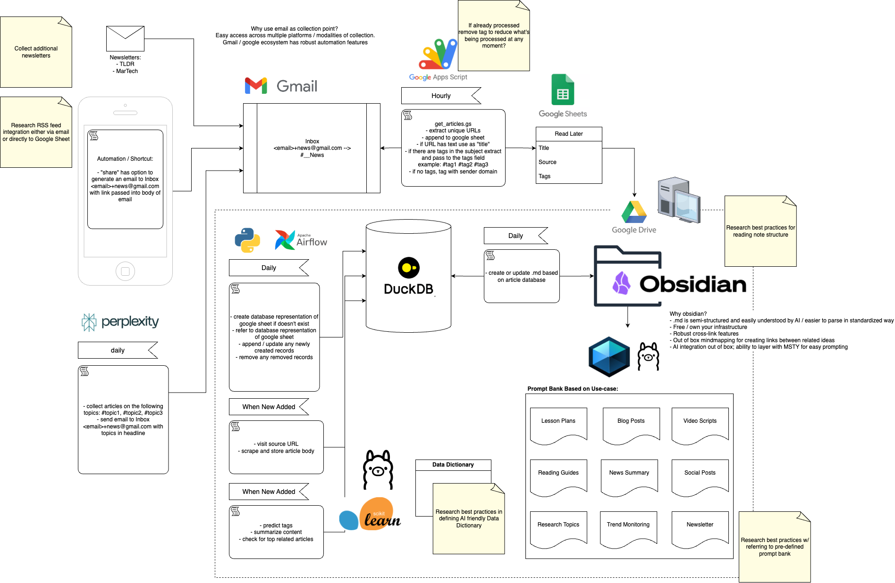

# Read Later

A streamlined system for collecting, organizing, and managing articles for later reading. This project automates the process of gathering articles from various sources and storing them in an organized manner for future reference.

## Overview

Read Later is designed to simplify the process of saving articles for future reading. It uses email as a central collection point, leveraging the Gmail/Google ecosystem for robust automation and cross-platform accessibility.

## Process Diagram

A visual representation of the Read Later workflow:

## Features

- **Email-based Collection**: Easy article submission through email
- **Automated Processing**: Automatic extraction of article metadata
- **Google Sheets Integration**: Centralized storage of article information
- **Tag-based Organization**: Flexible categorization system
- **Cross-platform Accessibility**: Access your reading list from any device

## Process Flow

1. **Collection**
   - Articles are collected through email submissions
   - Sources include:
     - Manual submissions via email
     - Automated newsletters (TLDR, MarTech)
     - Daily topic-based collections

2. **Processing**
   - System extracts unique URLs from incoming emails
   - Processes article metadata including:
     - Title
     - Source
     - Tags
   - Appends information to a centralized Google Sheet

3. **Organization**
   - Articles are stored in a "Read Later" section
   - Each article entry includes:
     - Title
     - Source
     - Tags for categorization
     - URL

## Technical Details

The system is built using:
- Google Apps Script for automation
- Gmail for article collection
- Google Sheets for data storage
- Email-based workflow for cross-platform compatibility

### Email Processing Logic

The system uses a sophisticated email processing workflow:

1. **Label-based Organization**
   - Uses Gmail labels `__News/unprocessed` and `__News/processed` to track article status
   - Automatically moves processed emails to the processed label

2. **URL Extraction and Deduplication**
   - Extracts URLs from HTML email content using regex pattern matching
   - Maintains a list of existing URLs to prevent duplicates
   - Cleans URLs by:
     - Removing tracking parameters
     - Decoding URI-encoded URLs
     - Handling tracking wrapper URLs (e.g., TLDR newsletter format)
     - Ensuring proper URL protocol (http/https)

3. **Metadata Processing**
   - Extracts article titles from email content
   - Processes sender information from email headers
   - Parses hashtags from email subjects (e.g., #tag1, #tag2)
   - Stores all metadata in a structured Google Sheet format

4. **Data Storage**
   - Stores processed articles in a Google Sheet with columns for:
     - Title
     - URL
     - Tags
     - Sender Name

### Automation Features

- Automated processing of labeled emails
- Intelligent URL cleaning and validation
- Smart title extraction from email content
- Tag-based categorization system
- Duplicate prevention mechanism

## Getting Started

[To be added: Setup instructions, configuration details, and usage guidelines]

## Contributing

[To be added: Contribution guidelines and process]

## License

[To be added: License information]
